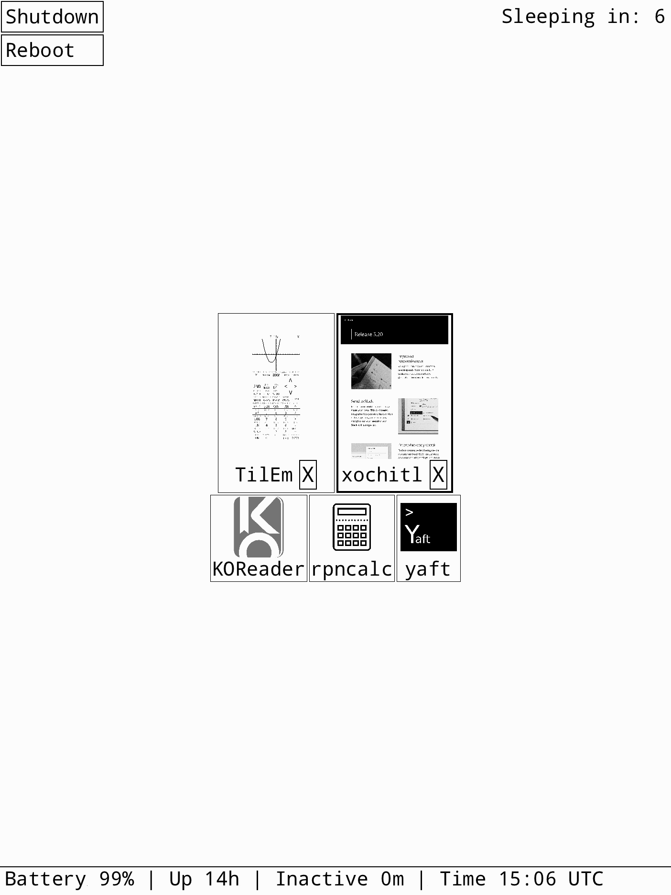

reMarkable Stuff (fork)
================

Collection of reMarkable related apps, utilities and libraries.

Differences compared to the upstream repo
--------

### Rocket

Launcher that uses the power button to show.

Changes made in this fork:
- If set, passcode is copied from xochitl config to display additional lockscreen in rocket itself
    - after multiple failures to authenticate, instead of timeout, device is shutdown to maintain security
- Launcher keeps focus on the previous app not the current one
    - this behavior enables switching between two currently used apps by double clicking the power button
- Standard suspended.png is displayed on suspend
- Poweroff & reboot buttons in the launcher menu (with confirmation dialog)
- Long press the power button in the launcher to switch focus to the next app
- Status bar with battery charge, current time in the launcher
- Paste screenshots into xochitl notebooks
    - first, build or download binary release of [karmtka](https://github.com/cyanjnpr/karMtka) and place it in a directory added to the PATH under the name 'karmtka'
    - long press the power button to take a screenshot
    - select area which you intend to copy
    - press "Copy to Xochitl" button and adjust operation parameters
    - screenshot will be converted to lines format and inserted into the selected page




When pressing the power button, the app drawer will be shown with a timeout of 10 seconds.
After 10 seconds the device will go to sleep, unless an app is picked before that timeout.
You can also interrupt the timeout by long pressing the power button.

This allows you to switch apps without relying on gestures.

### rMlib

Library for writing remarkable apps.
Includes an extensive declarative UI framework based on Flutter.

Changes made in this fork:
- Introduced a couple of new widgets and layouts to improve look & feel

Building
--------

Building for the remarkable can either use the [toltec toolchain](https://github.com/toltec-dev/toolchain)
or the reMarkable one:
```bash
# For toltec:
$ cmake --preset dev-toltec
# For remarkable:
$ cmake --preset dev

# To build everything:
$ cmake --build build/dev
# Or to build a specific app:
$ cmake --build build/dev --target yaft

# To create an ipk file:
$ cmake --build build/dev --target package
```

Emulating
---------

For faster development an `EMULATE` mode is supported by rMlib. This allows
running most apps on a desktop using SDL to emulate the remarkable screen.
To enable it pass `-DEMULATE=ON` to the cmake configure command, without using
the reMarkable toolchain of course.
```bash
$ cmake --preset dev-host
$ cmake --build build/host --target yaft
$ ./build/host/apps/yaft/yaft # Should launch Yaft with an emulated screen in a separete window.
```
